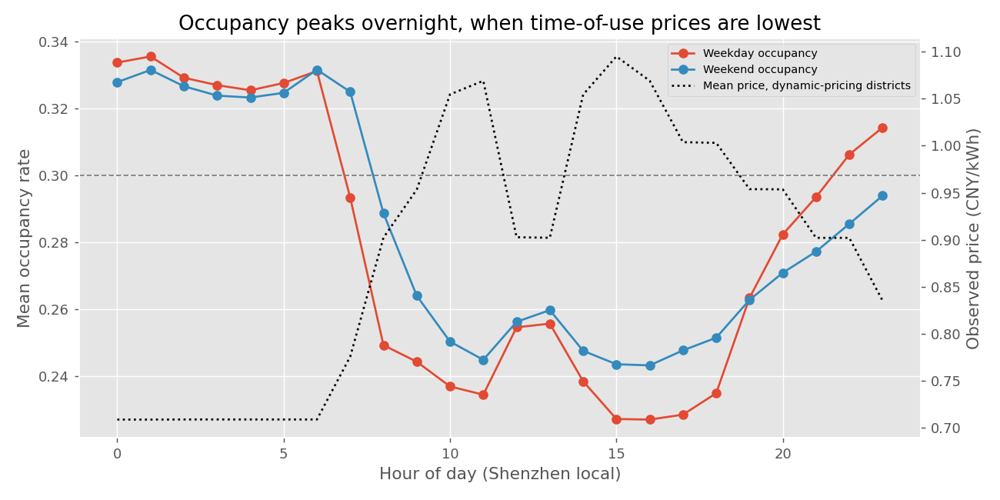
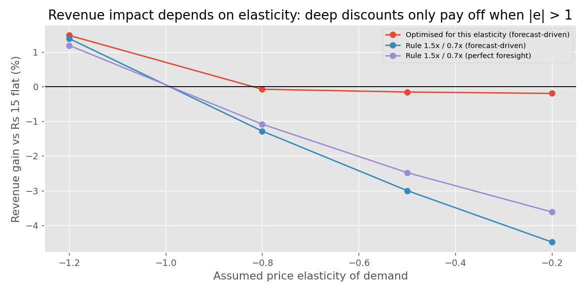

# Autonomous Multi-Agent System for Dynamic EV Charging Tariff Optimization

Flat ₹/kWh tariffs leave EV charging stations congested at peak and idle off-peak. This project builds a three-agent pricing system on 2.1M five-minute records from 247 Shenzhen districts (UrbanEV), plus 15k Caltech charging sessions (ACN-Data).

| Agent | Role |
|---|---|
| **Demand Prediction** | Optuna-tuned LightGBM forecasts next-hour occupancy, charging load (kWh) and congestion probability per district |
| **Tariff Pricing** | Surge when predicted occupancy > 80 %, discount when < 30 %; multipliers optimised for expected revenue |
| **Monitoring & Learning** | Scores every decision (revenue, utilization, Erlang-C wait proxy, customer response) and learns price elasticity from randomized price tests |

## Results (test week 12–18 July 2022)

- **Forecasting:** R² 0.955, RMSE 0.037 (33 % lower than a persistence baseline); 94.9 % of district-hours placed in the correct pricing band; congestion classifier PR-AUC 0.83.
- **Pricing (simulated, elasticity −0.5):** congested district-hours −53 %, peak-hour occupancy 87.9 % → 77.0 %, wait proxy −76 %, off-peak usage +18.5 %. Deep discounts cost revenue unless demand is elastic (|ε| > 1). A mild-discount policy keeps the congestion relief at about 0 % revenue cost.
- **Learning loop:** converges to the true elasticity within 7 daily episodes and switches policy when demand turns out to be elastic, eliminating regret.

<p>
  
  
</p>

## Repository structure

```
├── pipeline.py        # end-to-end pipeline: preprocessing → EDA → 3 agents → outputs
├── outputs/           # metrics.json, CSV results, figures/
├── data/              # raw datasets (not committed)
└── requirements.txt
```

## Running it

1. Download the datasets into `data/`:
   - `data/UrbanEV_SZ_districts/`: district-level UrbanEV CSVs, from [ST-EVCDP](https://github.com/IntelligentSystemsLab/ST-EVCDP)
   - `data/ACN/acndata_sessions.json.xlsx`: ACN-Data sessions, from [ev.caltech.edu](https://ev.caltech.edu/dataset.html)
2. Install the dependencies:

```bash
pip install -r requirements.txt
```

3. Run the pipeline from the repository root (about 5–10 minutes; all randomness is seeded):

```bash
python pipeline.py
```

Outputs are written to `outputs/`.
